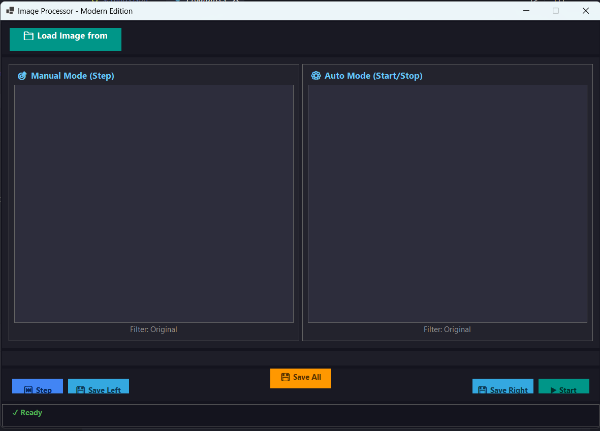

# 🎨 Image Processor - Unified Multi-Language Edition

**Professional Image Processing Application**  
**Available in C# (.NET) & Java (JavaFX)**

[](./csharp)
[](./java)
[](LICENSE)

---

## 📸 Screenshot



---

## 📌 Project Overview

**Image Processor** is a professional desktop application demonstrating modern image processing techniques with **dual language implementations** in the same repository. Load a single image and process it simultaneously in two independent streams using different modes—manual or automatic.

### 🌟 Unified Implementation
- **Single Repository** with both implementations
- **Identical Functionality** across languages
- **Separate Build Systems** (dotnet & Maven)
- **Comprehensive Documentation** for both editions
- **Educational Value** for comparing language paradigms

---

## 📂 Project Structure

```
ImageProcessor/
│
├── csharp/                          # C# .NET Edition
│   ├── MainForm.cs                  # UI + Logic (single file)
│   ├── Program.cs                   # Entry point
│   ├── ImageProcessorWinForms.csproj # Project configuration
│   └── README.md                    # C# specific docs
│
├── java/                            # Java JavaFX Edition
│   ├── pom.xml                      # Maven configuration
│   ├── src/
│   │   └── main/
│   │       ├── java/
│   │       │   └── com/imageprocessor/
│   │       │       ├── ImageProcessorApp.java
│   │       │       ├── core/
│   │       │       │   ├── FilterType.java
│   │       │       │   └── ImageProcessor.java
│   │       │       └── ui/
│   │       │           └── MainWindow.java
│   │       └── resources/
│   │           └── styles.css
│   └── README.md                    # Java specific docs
│
├── docs/                            # Shared documentation
│   ├── COMPARISON.md                # Technical comparison
│   ├── FEATURES.md                  # Feature overview
│   ├── ARCHITECTURE.md              # Architecture details
│   └── BUILD_GUIDE.md               # Build instructions
│
├── README.md                        # This file (main entry point)
├── LICENSE                          # Open source license
└── .gitignore                       # Git configuration
```

---

## 🚀 Quick Start

### Choose Your Edition

#### Option 1: C# (.NET) Edition
**Platform:** Windows  
**Framework:** .NET 8.0 Windows Forms

```bash
cd csharp
dotnet run
```

**Requirements:**
- Windows 7 or later
- .NET 8.0 Runtime

#### Option 2: Java (JavaFX) Edition
**Platform:** Windows, macOS, Linux  
**Framework:** JavaFX 21 (Java 17+)

```bash
cd java
mvn javafx:run
```

**Requirements:**
- Java 17 or later
- Maven (for building)

---

## ✨ Key Features

### Core Functionality
✅ **Load Single Image** → Automatically creates 2 independent copies  
✅ **Manual Mode (Step)** → User-controlled filter progression  
✅ **Auto Mode (Start/Stop)** → Automatic filter cycling  
✅ **6 Advanced Filters** → Original, Grayscale, Invert, Brightness, Contrast, Sepia  
✅ **Non-Destructive Editing** → Original image remains safe  
✅ **Flexible Saving** → Individual or batch export  
✅ **Real-time Feedback** → Status messages and progress indication  

### Technical Highlights
✅ **Asynchronous Processing** → No UI freezing  
✅ **High Performance** → Optimized filter algorithms  
✅ **Modern UI** → Professional dark theme  
✅ **Cross-Platform (Java)** → Windows, macOS, Linux  
✅ **Zero Dependencies (C#)** → Pure .NET implementation  
✅ **Clean Architecture** → Modular, maintainable code  

---

## 🎨 Available Filters

All filters are implemented identically in both editions:

| Filter | Description | Formula |
|--------|-------------|---------|
| **Original** | No modification | Input |
| **Grayscale** | Black & white conversion | Y = 0.299R + 0.587G + 0.114B |
| **Invert** | Negative color effect | Output = 1.0 - Input |
| **Brightness** | Increase luminosity | Output = Input × 1.2 |
| **Contrast** | Enhance light/dark difference | Output = 0.5 + (Input - 0.5) × 1.5 |
| **Sepia** | Vintage warm tone | Weighted RGB transformation |

---

## 🔄 Processing Modes

### Manual Mode (Step) - Left Panel
- **Control**: User clicks "Step" button
- **Progression**: One filter per click
- **Speed**: User-controlled
- **Use Case**: Detailed inspection of filters

### Auto Mode (Start/Stop) - Right Panel
- **Control**: Click "Start" to begin, "Stop" to pause
- **Progression**: Automatic cycling
- **Speed**: 1.2 seconds per filter
- **Use Case**: Quick preview and demonstration

---

## 📊 Edition Comparison

| Aspect | C# WinForms | Java JavaFX |
|--------|-------------|-------------|
| **Platform** | Windows only | Cross-platform |
| **Performance** | Excellent | Very Good |
| **Startup Time** | ~1 second | ~3 seconds |
| **Memory Usage** | 50-100 MB | 100-150 MB |
| **Native Feel** | Native Windows | Modern JavaFX |
| **Dependencies** | None | JavaFX library |
| **Learning Curve** | Moderate | Moderate |
| **Best For** | Windows users | Cross-platform teams |

---

## 💾 Supported File Formats

**Input Formats:**
- PNG (Portable Network Graphics)
- JPG/JPEG (Joint Photographic Experts Group)
- BMP (Bitmap Image)

**Output Formats:**
- PNG (recommended for quality)
- JPG (recommended for size)
- BMP (uncompressed)

---

## 🛠️ Technical Stack

### C# Edition
- **Language**: C# 11
- **Framework**: .NET 8.0 Windows Forms
- **Image Processing**: System.Drawing, ColorMatrix
- **Async Model**: async/await, Task.Run
- **Build Tool**: dotnet CLI

### Java Edition
- **Language**: Java 17+
- **Framework**: JavaFX 21.0.2
- **Image Processing**: PixelReader/Writer
- **Async Model**: Task, Timeline
- **Build Tool**: Maven

---

## 📋 Documentation

### Main Documentation
- **[README.md](README.md)** - This file (project overview)
- **[docs/COMPARISON.md](docs/COMPARISON.md)** - Technical comparison between editions
- **[docs/FEATURES.md](docs/FEATURES.md)** - Detailed feature overview
- **[docs/ARCHITECTURE.md](docs/ARCHITECTURE.md)** - Architecture and design patterns
- **[docs/BUILD_GUIDE.md](docs/BUILD_GUIDE.md)** - Build and deployment instructions

### Edition-Specific Documentation
- **[csharp/README.md](csharp/README.md)** - C# WinForms specific details
- **[java/README.md](java/README.md)** - Java JavaFX specific details

---

## 🎓 Learning Outcomes

This unified dual-implementation project teaches:

### Programming Concepts
- **Asynchronous Programming**: async/await (C#) vs Task (Java)
- **Image Processing**: Pixel manipulation and color transformations
- **Event-Driven Programming**: UI event handling and callbacks
- **Resource Management**: Memory and file I/O optimization

### Framework Knowledge
- **C# & .NET**: Windows Forms, System.Drawing, async patterns
- **Java & JavaFX**: Scene graph, Task framework, CSS styling

### Software Engineering
- **Architecture**: Clean code principles, separation of concerns
- **Performance**: Optimization techniques, benchmarking
- **Cross-Platform**: Write once, run anywhere (Java)
- **Deployment**: Packaging and distribution strategies

### Comparative Learning
- **Language Paradigms**: Comparing C# and Java approaches
- **Framework Differences**: WinForms vs JavaFX
- **Performance Metrics**: Benchmarking both implementations
- **Code Organization**: Different architectural patterns

---

## 🚀 Getting Started

### For C# Developers

1. **Navigate to C# directory**
   ```bash
   cd csharp
   ```

2. **Check requirements**
   - Windows 7 or later
   - .NET 8.0 Runtime

3. **Run application**
   ```bash
   dotnet run
   ```

4. **Build release**
   ```bash
   dotnet publish -c Release -r win-x64 --self-contained
   ```

### For Java Developers

1. **Navigate to Java directory**
   ```bash
   cd java
   ```

2. **Check requirements**
   - Java 17 or later
   - Maven 3.6+

3. **Build and run**
   ```bash
   mvn clean javafx:run
   ```

4. **Build JAR**
   ```bash
   mvn clean package
   java -jar target/ImageProcessorJavaFX-2.0.jar
   ```

---

## 📊 Performance Metrics

### Processing Speed
- Small images (< 1MB): < 100ms per filter
- Medium images (1-5MB): 100-500ms per filter
- Large images (> 5MB): 500ms-2s per filter

### Memory Usage
- C# Base: 50-100 MB
- Java Base: 100-150 MB
- Per image copy: Image size × 4 (RGBA)

### UI Responsiveness
- Button response: < 50ms
- Filter application: Non-blocking
- UI updates: < 16ms (60 FPS)

---

## 🔧 Troubleshooting

### C# Edition

**Application won't start**
```bash
# Check .NET installation
dotnet --version

# Install .NET 8.0 from:
# https://dotnet.microsoft.com/download
```

**Image won't load**
- Ensure file format is PNG, JPG, or BMP
- Check file permissions
- Verify file isn't corrupted

### Java Edition

**Application won't start**
```bash
# Check Java installation
java -version

# Ensure Java 17+ is installed
# Download from: https://adoptium.net/
```

**Maven build fails**
```bash
# Clear cache and rebuild
mvn clean install

# Check Maven installation
mvn -version
```

---

## 🎯 Project Statistics

| Metric | C# | Java | Total |
|--------|-----|------|-------|
| **Lines of Code** | ~800 | ~900 | ~1700 |
| **Classes** | 1 | 4 | 5 |
| **Filters** | 6 | 6 | 6 |
| **Supported Formats** | 3 | 3 | 3 |
| **Documentation Pages** | 2 | 1 | 3+ |

---

## 🚀 Future Enhancements

- [ ] Additional filters (Blur, Sharpen, Edge Detection)
- [ ] Real-time filter preview
- [ ] Drag & drop image loading
- [ ] Video processing support
- [ ] Batch processing
- [ ] Custom filter creation
- [ ] Undo/Redo functionality
- [ ] Dark/Light theme toggle
- [ ] Plugin system
- [ ] Cloud storage integration

---

## 📝 License

This project is open-source and available for educational and commercial use.

---

## 🤝 Contributing

Contributions are welcome! Please:
1. Fork the repository
2. Create a feature branch
3. Make your changes
4. Submit a pull request

---

## 📞 Support

For issues, questions, or suggestions:
1. Check the relevant documentation
2. Review the source code comments
3. Examine the troubleshooting section
4. Open an issue on GitHub

---

## 🎉 Credits

Developed as a professional educational project showcasing:
- Modern desktop application development
- Image processing fundamentals
- Asynchronous programming best practices
- Cross-platform development strategies
- Clean code principles
- Comprehensive documentation

---

## 📈 Project Highlights

✅ **Dual Language Implementation** - C# and Java in one repository  
✅ **Identical Functionality** - Same features in both editions  
✅ **Production Ready** - Both editions are fully functional  
✅ **Well Documented** - Comprehensive guides and comparisons  
✅ **Educational Value** - Learn multiple language paradigms  
✅ **Performance Optimized** - Asynchronous processing throughout  
✅ **Clean Architecture** - Modular, maintainable code  
✅ **Cross-Platform (Java)** - Run anywhere with Java  

---

## 🔗 Quick Navigation

### C# Edition
- [C# README](csharp/README.md)
- [C# Source Code](csharp/MainForm.cs)
- [C# Project File](csharp/ImageProcessorWinForms.csproj)

### Java Edition
- [Java README](java/README.md)
- [Java Source Code](java/src/main/java/com/imageprocessor/)
- [Java Build File](java/pom.xml)

### Documentation
- [Feature Overview](docs/FEATURES.md)
- [Technical Comparison](docs/COMPARISON.md)
- [Architecture Details](docs/ARCHITECTURE.md)
- [Build Guide](docs/BUILD_GUIDE.md)

---

**Version**: 2.0 (Unified Multi-Language Edition)  
**Last Updated**: 2025  
**Status**: ✅ Both Editions Production Ready  
**License**: Open Source  

---

## 🎨 Visual Preview

### C# WinForms Edition
- Native Windows look and feel
- Integrated with Windows themes
- Excellent performance
- Direct system integration

### Java JavaFX Edition
- Modern, clean interface
- Cross-platform compatibility
- Consistent appearance
- Flexible customization

---

**Choose Your Edition and Start Processing Images! 🎨**

**C# WinForms** → Windows-only, maximum performance  
**Java JavaFX** → Cross-platform, modern UI

Both are equally capable and production-ready!

---

## 📚 Table of Contents

1. [Quick Start](#quick-start)
2. [Features](#-key-features)
3. [Filters](#-available-filters)
4. [Processing Modes](#-processing-modes)
5. [Edition Comparison](#-edition-comparison)
6. [Technical Stack](#-technical-stack)
7. [Documentation](#-documentation)
8. [Learning Outcomes](#-learning-outcomes)
9. [Getting Started](#-getting-started)
10. [Performance](#-performance-metrics)
11. [Troubleshooting](#-troubleshooting)
12. [Future Enhancements](#-future-enhancements)

---

**Happy Image Processing! 🚀**
